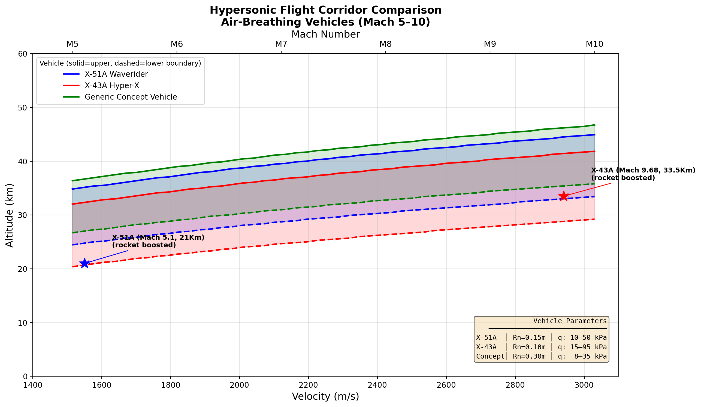

# Hypersonic Flight Corridor Mapper

A Python tool that calculates and visualizes the flyable altitude-velocity envelope for air-breathing hypersonic vehicles across Mach 5–10.

---

## What Is A Flight Corridor?

Hypersonic air-breathing vehicles (scramjets) can only operate within a narrow band of altitude and velocity — the **flight corridor**.

It is bounded by two hard physical limits:

- **Lower boundary** → Dynamic pressure too high — vehicle breaks apart structurally
- **Upper boundary** → Dynamic pressure too low — scramjet cannot ingest enough air to combust

This tool maps that corridor parametrically across Mach 5–10 for three vehicle configurations and validates results against real flight test data.

---

## Vehicles Modelled

| Vehicle | Nose Radius | Dynamic Pressure Range | Notes |
|---|---|---|---|
| X-51A Waverider | 0.15 m | 10–50 kPa | Boeing/DARPA scramjet, Mach 5.1 |
| X-43A Hyper-X | 0.10 m | 15–95 kPa | NASA, Mach 9.68 world record |
| Generic Concept | 0.30 m | 8–35 kPa | Blunt nose design reference |

---

## Physics Models

| Module | Model Used |
|---|---|
| atmosphere.py | 1976 U.S. Standard Atmosphere — layered temperature/pressure model, verified against official tables |
| aerothermal.py | Sutton-Graves stagnation point heat flux equation |
| corridor.py | Dynamic pressure sweep across 10–80 km altitude range |
| visualizer.py | Multi-vehicle parametric corridor comparison |

---

## Project Structure

    hypersonic-flight-corridor/
    ├── atmosphere.py       # 1976 Standard Atmosphere model
    ├── aerothermal.py      # Sutton-Graves heating + dynamic pressure
    ├── corridor.py         # Parametric corridor finder (configurable per vehicle)
    ├── visualizer.py       # Multi-vehicle comparison plot generator
    ├── main.py             # Entry point
    └── requirements.txt    # Dependencies

---

## How To Run

    pip install -r requirements.txt
    python visualizer.py

---

## Results

- X-43A (Mach 9.68, 33.5 km) falls within its modelled corridor ✅
- Corridor width ~10 km at Mach 6 — consistent with published literature ✅
- Atmosphere model verified against 1976 Standard Atmosphere official tables ✅
- Blunt nose vehicles (larger Rn) produce wider, higher corridors — confirms theory ✅

---

## Key Findings

- Corridor rises and widens with increasing Mach number
- Sharper nose vehicles (X-43A) require stronger structures to fly lower
- Blunt nose vehicles trade heating efficiency for wider operating margins
- X-51A operated below its pure scramjet corridor during rocket-boost phase

---

## Author

**Parthip** | B.Sc. Aerospace Engineering, Amity University Dubai

- Vehicle Dynamics Lead — Formula Student Electric Vehicle Team
- Co-author, Q1 Journal Paper (IRECE 2026)
- Student Affiliate, Royal Aeronautical Society (RAeS)

[LinkedIn](https://www.linkedin.com/in/parthip-prasooth-915127278)
